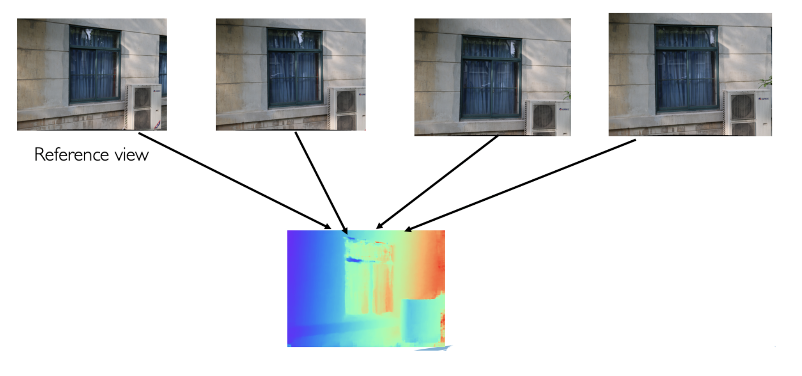
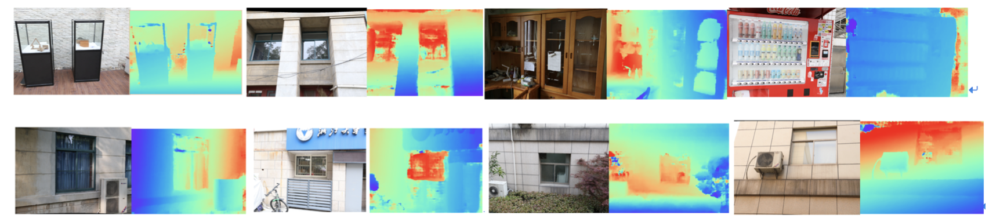

# README

It's a [tensorpack](https://github.com/tensorpack/tensorpack) implementation of [MVSNet](https://arxiv.org/abs/1804.02505), the original code is [here](https://github.com/YoYo000/MVSNet).

## demo cases

## TODO

- [ ] reorganize code, provide train, val, test script
- [ ] add HOW TO USE section